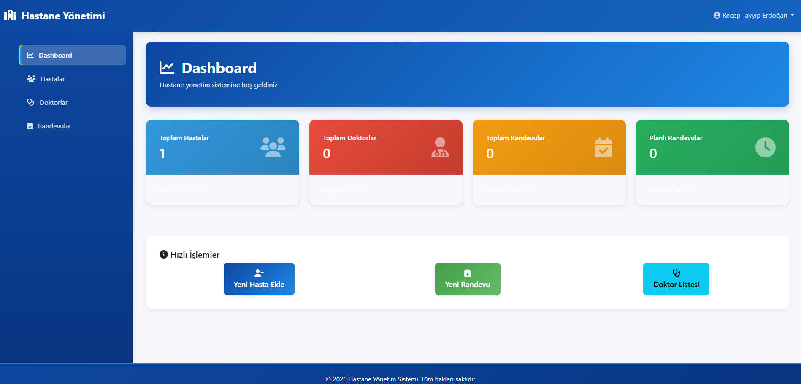

# 🏥 Hastane Yönetim Sistemi

Profesyonel bir hastane yönetim sistemi - Hastalar, Doktorlar ve Randevu Yönetimi



## 📋 İçindekiler

- [Özellikler](#-özellikler)
- [Gereksinimler](#-gereksinimler)
- [Kurulum](#-kurulum)
- [Proje Yapısı](#-proje-yapısı)
- [Web Arayüzü](#-web-arayüzü)
- [Kullanım Kılavuzu](#-kullanım-kılavuzu)

---

## ✨ Özellikler

### 🎯 Temel Özellikler
- ✅ **Hasta Yönetimi** - Hasta kayıtlarını oluştur, güncelle, sil
- ✅ **Doktor Yönetimi** - Doktor bilgileri ve uzmanlık alanları
- ✅ **Randevu Sistemi** - Randevu planlama ve yönetimi
- ✅ **Kullanıcı Yönetimi ve Kimlik Doğrulaması** - Rol tabanlı erişim kontrolü (DOCTOR, SECRETARY)
- ✅ **Responsive Web Arayüzü** - Modern Bootstrap 5 tasarımı

### 🚀 Ekstra Özellikler
- 🆕 **Doktor Çalışma Saatleri** - Doktorların haftalık çalışma programı
- 🆕 **Tıbbi Kayıtlar** - Hasta muayene ve tedavi geçmişi
- 🆕 **Kan Grubu ve Alerjiler** - Hasta tıbbi bilgileri
- 🆕 **Arama İşlevi** - Hasta ve doktor araştırması
- 🆕 **Admin Paneli** - Django admin ile gelişmiş yönetim

---

## 📦 Gereksinimler

- Python 3.8+
- Django 5.2.3
- SQLite3 (veya MySQL/PostgreSQL)
- Bootstrap 5.3.0 (CDN)

### Yüklenecek Paketler

```bash
pip install -r requirements.txt
```

**requirements.txt içeriği:**
- Django==5.2.3
- Pillow==12.1.1

---

## 🔧 Kurulum

### 1. Proje Dosyalarını İndir

```bash
git clone <repository-url>
cd hospital_managment_api
```

### 2. Virtual Environment Oluştur

```bash
python -m venv venv
source venv/bin/activate  # Linux/Mac
# veya
venv\Scripts\activate     # Windows
```

### 3. Bağımlılıkları Yükle

```bash
pip install -r requirements.txt
```

### 4. Veritabanı Migrasyonları

```bash
python manage.py migrate
```

### 5. Superuser Oluştur

```bash
python manage.py createsuperuser
```

Çıktıda sorulacak sorulara cevap verin:
- Username: admin
- Email: admin@example.com
- Password: (şifre girin)

### 6. Sunucuyu Başlat

```bash
python manage.py runserver
```

Tarayıcınızı açın: **http://127.0.0.1:8000**

---

## 📁 Proje Yapısı

```
hospital_managment_api/
├── app/                          # Ana uygulama yapılandırması
│   ├── settings.py              # Django ayarları
│   ├── urls.py                  # Ana URL yönlendiricisi
│   └── wsgi.py                  # WSGI yapılandırması
│
├── user/                         # Kullanıcı uygulaması
│   ├── models.py                # CustomUser modeli
│   ├── views.py                 # Kimlik doğrulama görünümleri
│   ├── forms.py                 # ModelForms
│   ├── urls.py                  # URL yönlendiricisi
│   └── admin.py                 # Django Admin yapılandırması
│
├── doctor/                       # Doktor uygulaması
│   ├── models.py                # Doctor & DoctorSchedule modelleri
│   ├── views.py                 # Doktor görünümleri
│   ├── forms.py                 # ModelForms
│   ├── urls.py                  # URL yönlendiricisi
│   └── admin.py                 # Django Admin yapılandırması
│
├── patient/                      # Hasta uygulaması
│   ├── models.py                # Patient & MedicalRecord modelleri
│   ├── views.py                 # Hasta görünümleri
│   ├── forms.py                 # ModelForms
│   ├── urls.py                  # URL yönlendiricisi
│   └── admin.py                 # Django Admin yapılandırması
│
├── appointment/                  # Randevu uygulaması
│   ├── models.py                # Appointment modeli
│   ├── views.py                 # Randevu görünümleri
│   ├── forms.py                 # ModelForms
│   ├── urls.py                  # URL yönlendiricisi
│   └── admin.py                 # Django Admin yapılandırması
│
├── templates/                    # HTML Template'leri
│   ├── base.html                # Temel template (Bootstrap)
│   ├── dashboard.html           # Dashboard
│   ├── login.html               # Giriş sayfası
│   ├── register.html            # Kayıt sayfası
│   ├── patient_list.html        # Hasta listesi
│   ├── patient_form.html        # Hasta formu
│   ├── patient_delete.html      # Hasta silme onayı
│   ├── appointment_list.html    # Randevu listesi
│   ├── appointment_form.html    # Randevu formu
│   ├── appointment_delete.html  # Randevu silme onayı
│   ├── doctor_list.html         # Doktor listesi
│   └── doctor_detail.html       # Doktor detayları
│
├── db.sqlite3                    # SQLite veritabanı
├── manage.py                     # Django yönetim komut satırı
└── requirements.txt              # Python bağımlılıkları
```

---

## 🗄️ Veritabanı Modelleri

### 1. **CustomUser** (Kullanıcı)
```python
- username: Benzersiz kullanıcı adı
- email: E-mail adresi
- first_name: Adı
- last_name: Soyadı
- phone: Telefon numarası
- role: Rol seçimi (DOCTOR, SECRETARY)
- created_at: Oluşturma tarihi
```

### 2. **Doctor** (Doktor)
```python
- user: CustomUser (One-to-One)
- license_number: Lisans numarası (Benzersiz)
- specialization: Uzmanlık alanı
- created_at: Oluşturma tarihi
```

### 3. **DoctorSchedule** (Doktor Çalışma Saatleri)
```python
- doctor: Doctor (Foreign Key)
- day_of_week: Haftanın günü (0-6)
- start_time: Başlama saati
- end_time: Bitiş saati
- is_available: Uygun mu?
```

### 4. **Patient** (Hasta)
```python
- first_name: Adı
- last_name: Soyadı
- national_id: TC Numarası (Benzersiz)
- date_of_birth: Doğum tarihi
- gender: Cinsiyet (M/F)
- phone: Telefon numarası
- email: E-mail adresi
- address: Adres
- blood_type: Kan grubu
- allergies: Alerjiler
- created_at: Oluşturma tarihi
- updated_at: Güncellenme tarihi
```

### 5. **MedicalRecord** (Tıbbi Kayıt)
```python
- patient: Patient (Foreign Key)
- doctor: CustomUser (Foreign Key)
- diagnosis: Teşhis
- treatment: Tedavi
- prescription: Reçete (İsteğe bağlı)
- notes: Notlar (İsteğe bağlı)
- visit_date: Muayene tarihi
- created_at: Oluşturma tarihi
- updated_at: Güncellenme tarihi
```

### 6. **Appointment** (Randevu)
```python
- patient: Patient (Foreign Key)
- doctor: Doctor (Foreign Key)
- appointment_date: Randevu tarihi ve saati
- status: Durum (SCHEDULED, COMPLETED, CANCELLED)
- notes: Notlar (İsteğe bağlı)
- created_at: Oluşturma tarihi
```

---

## 🎨 Web Arayüzü

### 🎯 Tasarım Özellikleri
- **Modern Tasarım**: Bootstrap 5.3.0 ile oluşturulmuş
- **Responsive Layout**: Mobil, tablet ve masaüstü uyumlu
- **Font Awesome İkonları**: 6.4.0 ikonları
- **Gradient Navbar**: Profesyonel başlık tasarımı
- **Sidebar Menu**: Kolay navigasyon
- **Card Layout**: Veri görüntülemesi için kartlar
- **Durum Göstergeleri**: Badge ile durumlar
- **Modern Efektler**: Gölge ve geçiş efektleri

### 📄 Sayfalar

#### 1. **Giriş Sayfası** (`/login/`)
- Kullanıcı adı ve şifre girişi
- Kayıt ol bağlantısı
- Form validasyonu

#### 2. **Kayıt Sayfası** (`/register/`)
- Yeni kullanıcı oluşturma
- Rol seçimi (Doctor/Secretary)
- Şifre doğrulaması

#### 3. **Dashboard** (`/dashboard/`)
Sistem özeti ve hızlı istatistikler
- Toplam hasta sayısı
- Toplam doktor sayısı
- Toplam randevu sayısı
- Planlı randevu sayısı
- Hızlı işlem butonları

#### 4. **Hasta Yönetimi** (`/patients/`)
- Hasta listesi tablosu
- Hasta arama işlevi
- Düzenle/Sil işlemleri
- Yeni hasta ekleme
- Hasta detayları (TC, Doğum tarihi, Cinsiyet, etc.)

#### 5. **Hasta Formu** (`/patients/create/`, `/patients/<id>/update/`)
- Ad, soyad, TC numarası
- Doğum tarihi ve cinsiyet
- Telefon ve adres
- Kan grubu ve alerjiler
- Bootstrap form tasarımı

#### 6. **Randevu Yönetimi** (`/appointments/`)
- Randevu tablosu
- Durum filtreleme (Planlı, Tamamlandı, İptal)
- Randevu düzenleme/silme
- Tarih ve doktor bilgileri

#### 7. **Randevu Formu** (`/appointments/create/`, `/appointments/<id>/update/`)
- Hasta seçimi
- Doktor seçimi
- Tarih ve saat seçimi
- Durum ve notlar

#### 8. **Doktor Listesi** (`/doctors/`)
- Doktor kartları
- Uzmanlık bilgileri
- Lisans numarası
- İletişim bilgileri
- Randevu al butonu

---

## 🛠️ Django Admin Paneli

URL: `http://127.0.0.1:8000/admin/`

Superuser ile giriş yapın (admin / admin123)

### Kayıtlı Modeller
- **Kullanıcı Yönetimi**: Rol, aktif durumu, kayıt tarihi
- **Doktor Yönetimi**: Doktorlar, çalışma saatleri, uzmanlık alanları
- **Hasta Yönetimi**: Hasta listesi, kan grubu, cinsiyet filtreleme
- **Tıbbi Kayıtlar**: Teşhis, tedavi, reçete, notlar
- **Randevu Yönetimi**: Randevu listesi, durum filtreleme, tarih aralığı filtreleme

---

## 💡 Kullanım Kılavuzu

### 1. Sistem İlk Kullanımı

**Adım 1: Giriş Yapın**
```
URL: http://127.0.0.1:8000/login/
Kullanıcı Adı: admin
Şifre: admin123
```

**Adım 2: Dashboard'ı Görüntüleyin**
- Sistemin genel istatistiklerini görebilirsiniz
- Hızlı işlem butonlarına tıklayabilirsiniz

### 2. Yeni Hasta Ekleme

**Web Arayüzü:**
```
1. Sol menüden "Hastalar" sayfasına gidin
2. "Yeni Hasta Ekle" butonuna tıklayın
3. Formu doldurun:
   - Ad, Soyad, TC Numarası
   - Doğum Tarihi, Cinsiyet
   - Telefon, Email, Adres
   - Kan Grubu, Alerjiler
4. "Kaydet" butonuna tıklayın
```

### 3. Randevu Oluşturma

**Web Arayüzü:**
```
1. Sol menüden "Randevular" sayfasına gidin
2. "Yeni Randevu" butonuna tıklayın
3. Formu doldurun:
   - Hasta seçin
   - Doktor seçin
   - Tarih ve saat belirleyin
   - Durum ve notlar ekleyebilirsiniz
4. "Kaydet" butonuna tıklayın
```

### 4. Doktor Listesini Görüntüleme

```
1. Sol menüden "Doktorlar" sayfasına gidin
2. Doktor kartlarını görüntüleyin
3. Doktor adına tıklayarak detaylı bilgileri görüntüleyin
4. "Randevu Al" butonuyla hızlıca randevu planlayabilirsiniz
```

---

## 🔐 Güvenlik Ipuçları

### Üretim Ortamı İçin

```python
# settings.py

DEBUG = False
ALLOWED_HOSTS = ['example.com', 'www.example.com']
SECRET_KEY = 'your-very-long-secret-key-here'

DATABASES = {
    'default': {
        'ENGINE': 'django.db.backends.postgresql',
        'NAME': 'hospital_db',
        'USER': 'db_user',
        'PASSWORD': 'secure_password',
        'HOST': 'localhost',
        'PORT': '5432',
    }
}

CSRF_COOKIE_SECURE = True
SESSION_COOKIE_SECURE = True
SECURE_SSL_REDIRECT = True
SECURE_HSTS_SECONDS = 31536000
```

### Günlük Kullanış İçin
- `DEBUG = True` sadece geliştirme ortamında kullanın
- Varsayılan Admin paneli kullanıcısını değiştirin
- Düzenli veritabanı yedeklemeleri alın

---

## 🐛 Troubleshooting

### Hata: "ModuleNotFoundError: No module named 'django'"
```bash
pip install -r requirements.txt
```

### Hata: "no such table: patient_patient"
```bash
python manage.py migrate
```

### Hata: "TemplateDoesNotExist at /patients/"
```
Çözüm: Templates dizininin settings.py'da doğru tanımlandığından emin olun
templates/ dizini proje kökünde olmalıdır
```

### Admin paneline erişim hatası
```bash
python manage.py createsuperuser
```

### Portlu erişim problemi
```bash
python manage.py runserver 0.0.0.0:8000
```

---

## 📊 Proje İstatistikleri

- **Modeller**: 4 (Patient, Doctor, Appointment, CustomUser)
- **Views**: 15+ (List, Create, Update, Delete views)
- **Forms**: 6 (ModelForms tüm uygulamalar için)
- **Template'ler**: 10+ (Bootstrap 5 tasarımı)
- **Database**: SQLite (PostgreSQL/MySQL uyumlu)

---

## 👥 İletişim & Geri Bildirim

Sorularınız mı var? Bize ulaşın:
- **Email**: batuhanyilmaz0011@gmail.com

Bu proje MIT LICENSE ile lisanslanmıştır.
